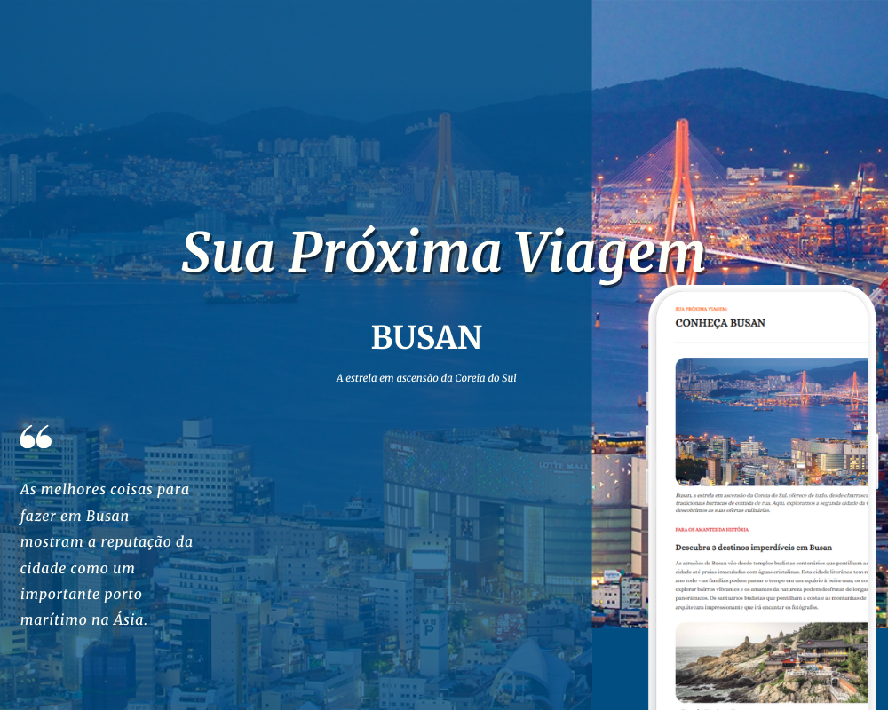

# 🗺️ Conheça Busan

Projeto de página turística destacando os principais pontos históricos e culturais da cidade de Busan, na Coreia do Sul.

---

### 📸 Preview

---

### 🧪 Tecnologias

- HTML5  
- CSS3

---

### 📍 Sobre o Projeto

Esse foi mais um projeto que desenvolvi no início dos meus estudos em programação, feito com apoio das aulas da **Rocketseat**.  

Aprendi muito sobre como montar a estrutura correta de uma página, como aplicar boas práticas de layout, semântica HTML e organização de conteúdo.  

A página apresenta três destinos turísticos imperdíveis em **Busan**, com foco em:

- Conteúdo informativo e organizado
- Tipografia e hierarquia visual
- Imagens ilustrativas e layout responsivo

---

### 🧳 Pontos apresentados

1. **Templo Haedong Yonggungsa**
2. **Templo Beomeo-sa**
3. **Parque Yongdusan**

---

### 📁 Estrutura

- `index.html` – Estrutura da página  
- `style.css` – Estilos aplicados  
- `assets/` – Imagens do projeto

---

Feito com ❤️ junto com a [Rocketseat](https://www.rocketseat.com.br/)
